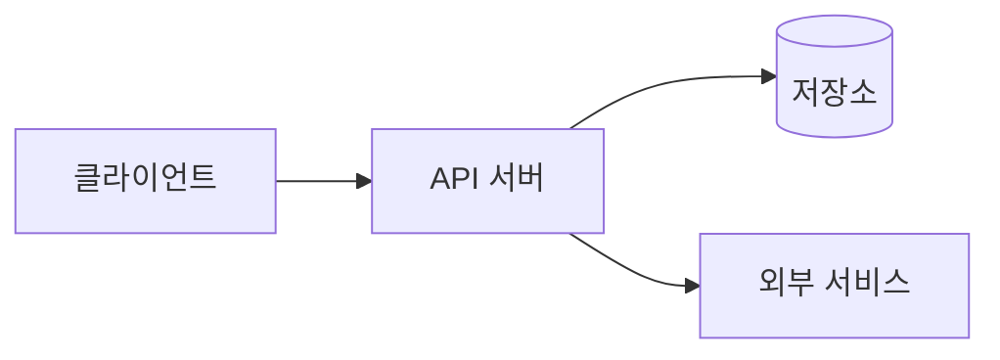
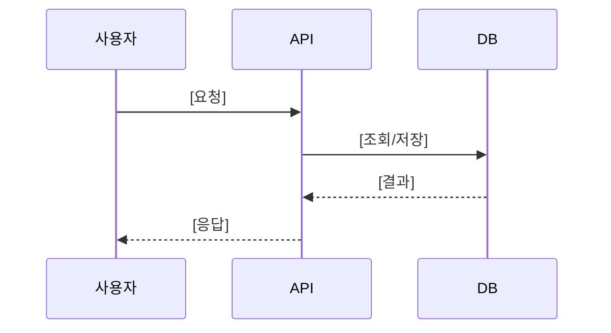

# Architecture — [기능/프로젝트 이름]

작성일: YYYY-MM-DD
기준 문서: docs/PRD.md

## 기술 스택

| 레이어 | 선택 | 근거 |
|--------|------|------|
| 런타임 | [Node.js / Python / Go / ...] | [왜] |
| 프레임워크 | [...] | [왜] |
| 저장소 | [...] | [왜] |
| 배포 | [...] | [왜] |

## 컴포넌트 경계

> 컴포넌트마다: 무엇을 하나, 어떻게 쓰나, 무엇에 의존하나 — 세 가지가 답 가능해야 한다.

| 컴포넌트 | 책임 (한 줄) | 의존 대상 |
|----------|-------------|----------|
| [이름] | [무엇을 하나] | [무엇에 기대나] |

## 데이터 흐름

> 핵심 시나리오 1~2개만. 모든 흐름을 그리지 말 것.

## 비기능 요구

- [성능/보안/운영 제약 중 이 프로젝트에 실제로 걸리는 것만 — 예: p95 < 300ms, PII 저장 금지]
