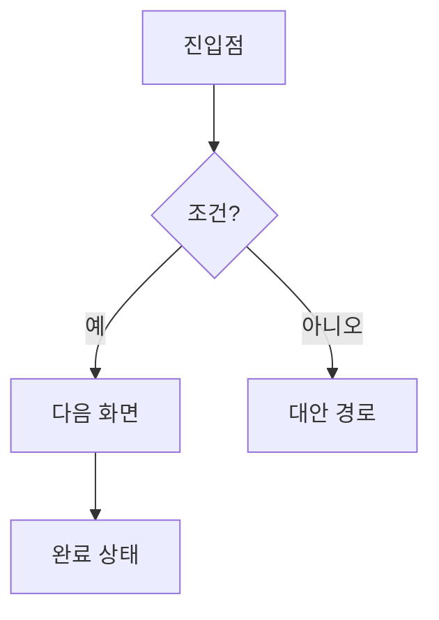

# User Flow — [기능/프로젝트 이름]

작성일: YYYY-MM-DD
기준 문서: docs/PRD.md

## 핵심 플로우

> PRD의 Goals 하나당 플로우 하나. 해피 패스 먼저, 분기는 그 다음.

### [플로우 1 — 예: 가입 후 첫 액션]

**엣지 케이스**

- [실패/이탈 지점과 그때의 동작 — 예: 인증 실패 시 재시도 3회 후 잠금]

## 화면/상태 목록

| 화면·상태 | 진입 조건 | 이탈 경로 |
|-----------|----------|----------|
| [이름] | [어디서 오나] | [어디로 가나] |
